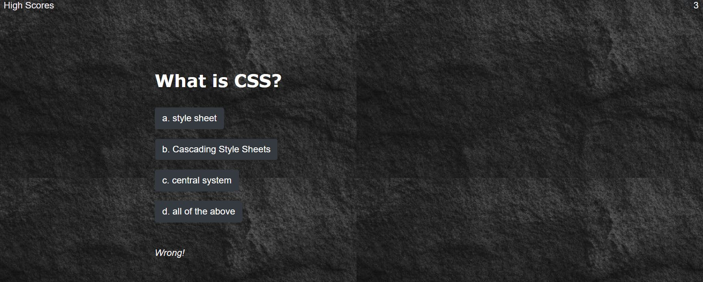

# Timed_Quiz_Challenge

For this challenge we created timed coding quiz with multiple-choice questions. This app is written from scratch.

Here are the user story and Acceptance Criteria 

USER STORY 

AS A coding boot camp student
I WANT to take a timed quiz on JavaScript fundamentals that stores high scores
SO THAT I can gauge my progress compared to my peers

ACCEPTANCE CRITERIA 

GIVEN I am taking a code quiz
WHEN I click the start button
THEN a timer starts and I am presented with a question
WHEN I answer a question
THEN I am presented with another question
WHEN I answer a question incorrectly
THEN time is subtracted from the clock
WHEN all questions are answered or the timer reaches 0
THEN the game is over
WHEN the game is over
THEN I can save my initials and my score

Here are the steps we followed to complete this timed quiz challenge:
1. Timed quiz challenge page is created using HTML,CSS, JS, Bootstrap.

2. When we click Start button, the timer will start from 60 seconds for 5 questions with choices. 

3. When you click the correct answer the correct mesasge will be shown at the bottom of the choices. If you clicked the wrong one then it will show wrong. 

4. When you click the correct answer the timer will be flow in the same. But if you click the wrong one then the timer will subtract 3 seconds from the total time. 

5. Once you are done with quiz the total score will be shown and when you enter your initial it will shown in the list of high score page. 

Here is the screenshot of the completed challenge. 

